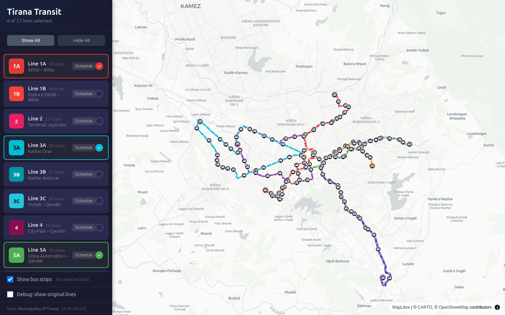

# Tirana Transit Map

Interactive map of public bus routes in Tirana, Albania. It turns the repository's municipality GTFS snapshot into a route explorer with readable corridor offsets, stop service, timetables, and shareable URL state.



## Features

- Pan and zoom over Tirana with MapLibre GL.
- Explore 27 bus routes with offsets that keep shared corridors readable.
- Inspect which routes serve a stop and open per-route timetables.
- Share selected routes and display settings through the URL hash.
- Use a responsive interface plus an optional geometry-debug view.

## Data coverage

| Metric | Value |
|---|---|
| Routes | 27 (1A-B, 2, 3A-C, 4, 5A-B, 6, 8A-C, 9A-B, 10A-C, 11, 12A-B, 13A-B, 15A-B, 16A-B) |
| Stops | 490 |
| Trips | 17,474 |
| Service period | January 2026 to December 2026 |
| Data source | [Municipality of Tirana GTFS](https://pt.tirana.al/gtfs/gtfs.zip), feed `2026-08-12` |

These figures describe the checked-in snapshot, not necessarily the current live network. This is a static schedule map, not live vehicle tracking or a journey planner.

## Run locally

The application requires Node.js 22.13 or newer.

```bash
npm ci
npm run dev
```

Open `http://localhost:5173`.

## Production build

```bash
npm test
npm run lint
npm run build
```

The tests protect shareable URL state and validate the checked-in GTFS-derived route, stop, geometry, timetable, and trip-count contracts, including per-shape length and endpoint preservation.

Vite writes the production bundle to `dist/`.

## Architecture

```text
map-app/
├── src/
│   ├── components/
│   │   ├── TransitMap.jsx      # MapLibre map
│   │   ├── RouteSidebar.jsx    # Route selection
│   │   ├── TimetableModal.jsx  # Schedule view
│   │   └── ErrorBoundary.jsx   # Render failure boundary
│   ├── App.jsx                 # Application state
│   ├── App.css                 # Component styles
│   └── main.jsx                # Entry point
├── public/data/                # Generated transit data
└── package.json
```

The pipeline in `../gtfs-data/convert_to_geojson.py` parses GTFS, detects shared corridors, offsets overlapping geometry, and regenerates `public/data/`.

## Shareable URL state

```text
#routes=1,3,6      # comma-separated GTFS route IDs
#stops=1           # show bus stops
#debug=1           # compare original and offset geometry
```

For example, `http://localhost:5173/#routes=1,3,6,10,15,46&stops=1` selects the short-name routes 1A, 3A, 5A, 8A, 10A, and 13A.

## Troubleshooting

- If the map is empty, confirm `public/data/` contains the generated GeoJSON and metadata files.
- Run the application through Vite rather than opening `index.html` directly.
- To refresh the data, run the root README's pipeline instructions against an updated feed.

## Licensing and provenance

Original application code is covered by the repository's [MIT License](../LICENSE). The bundled GTFS snapshot and generated transit data are separate: `../gtfs-data/feed_info.txt` declares `CC-BY-SA-4.0` and the municipality attribution that must accompany reuse. Third-party libraries and assets retain their own licenses.
